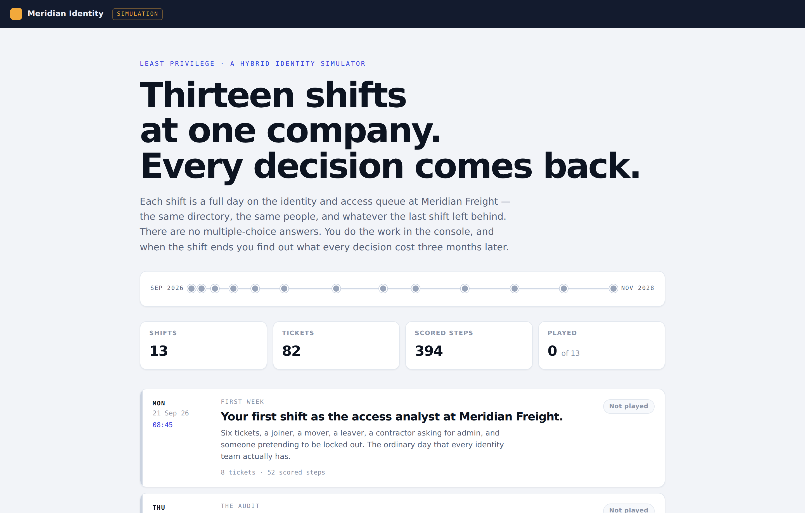
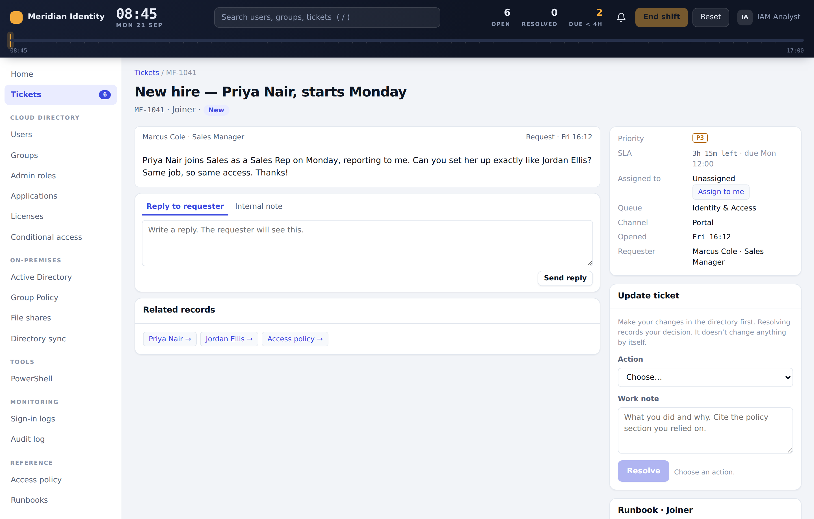
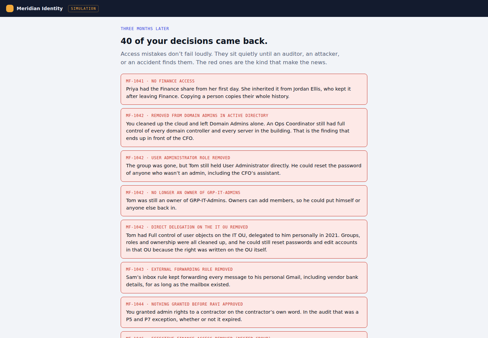
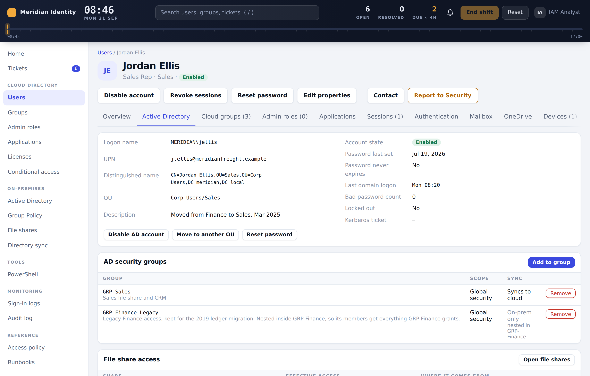
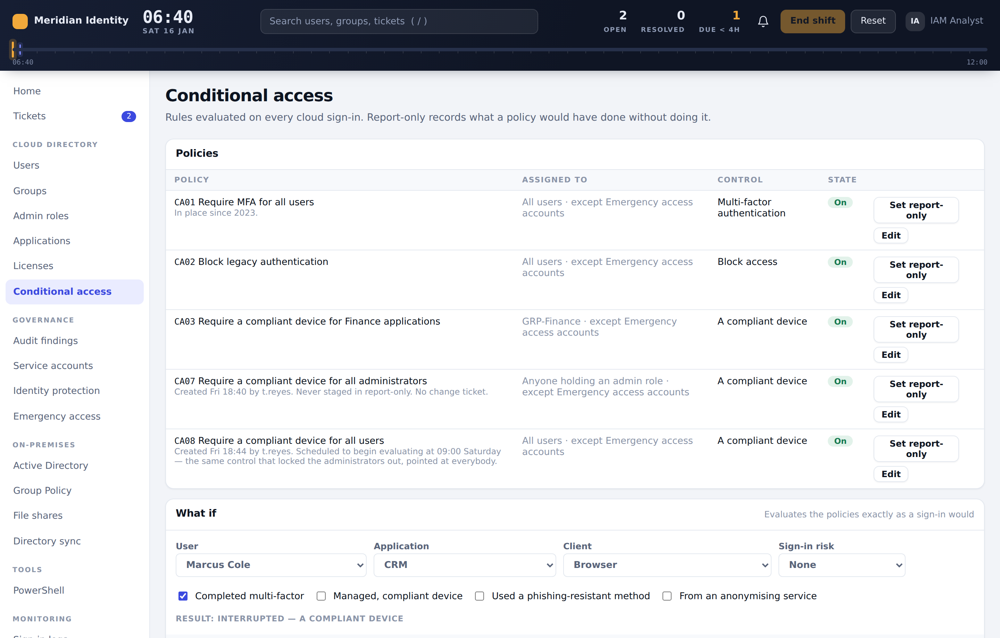
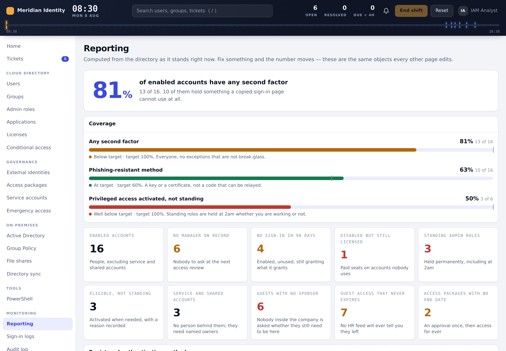
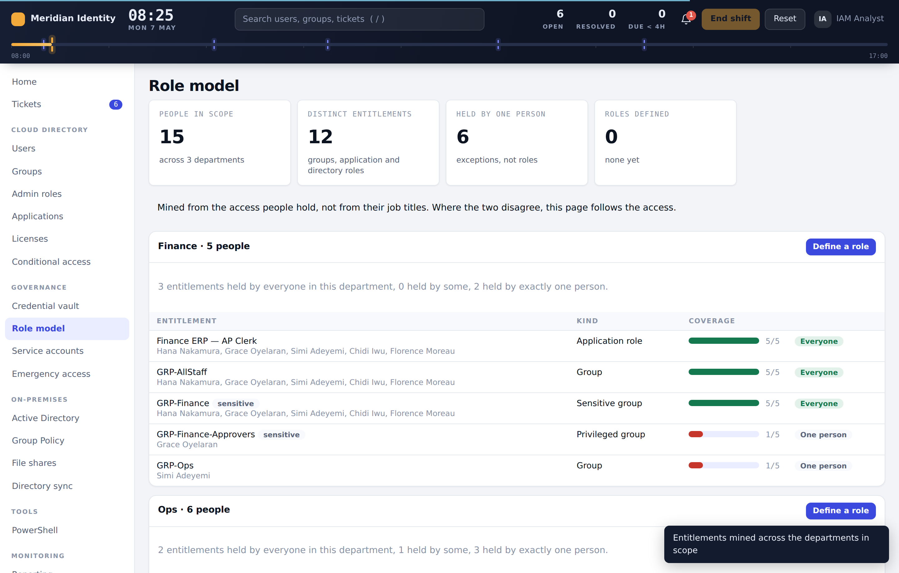
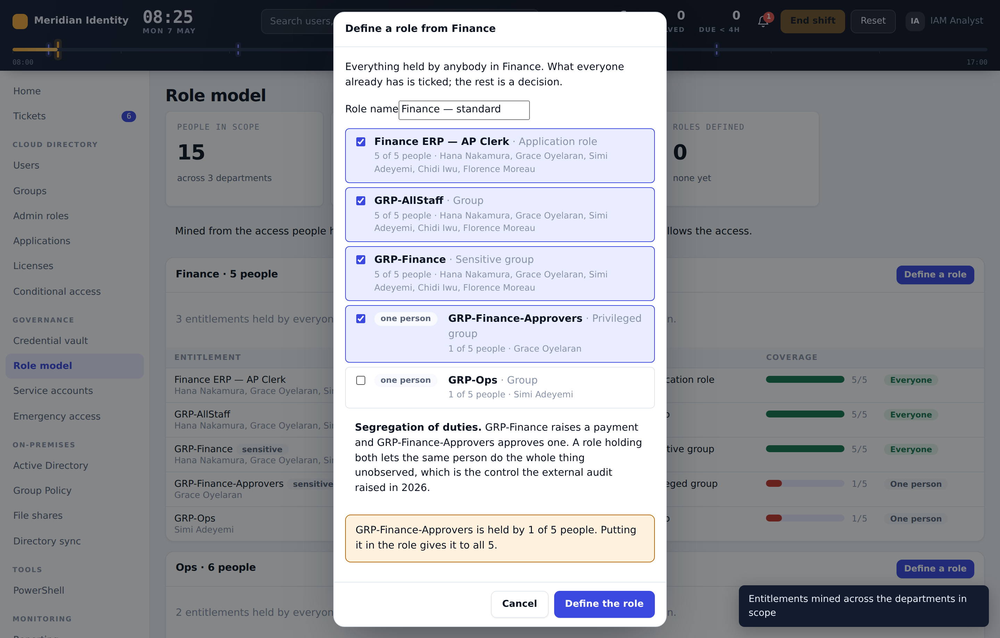
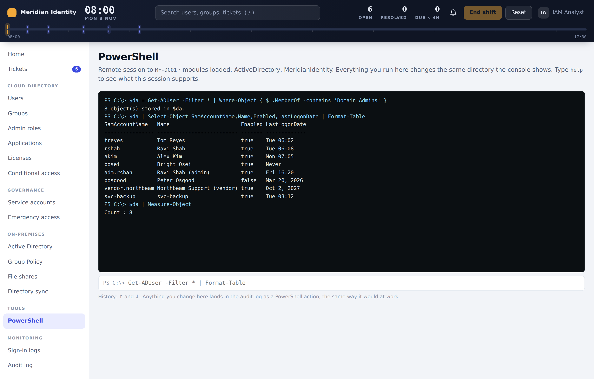

# Least Privilege

**An identity and access management simulator.** Fifteen shifts on the IAM queue
at a fictional freight company, each one a full working day, in order, across
thirty-two months — the same directory, the same people, and whatever the last
shift left behind.

**[▶ Play it →](https://maurishahouston11-lab.github.io/least-privilege/)**  ·
[How it was built →](CASE-STUDY.md)

There are no multiple-choice answers. You do the work in a hybrid console —
on-premises Active Directory on one side, a cloud tenant on the other — and when
the shift ends you find out what every decision cost three months later.



---

## Start here

Ten minutes, in this order:

1. **Shift 1 — First Week.** Six tickets, the ordinary day. It teaches the
   console and the scoring.
2. End the shift without finishing everything. **Read the scorecard**: each
   missed step comes back as what it cost, in the specific, three months on.
3. If you only want to see the engineering, open **Shift 10** and look at the
   Single sign-on tab on Finance ERP, or **Shift 5** and use the What-If panel
   on the Conditional access page.

Progress is kept per shift in your browser. Nothing is sent anywhere.

## The shifts

| | Shift | What it covers |
|---|---|---|
| 1 | **First Week** | Joiner, mover, leaver, a contractor asking for admin, and someone pretending to be locked out |
| 2 | **The Audit** | Five findings, one shift to clear what can be cleared and evidence what can't |
| 3 | **The Service Account** | Machine identities, expiring secrets, and a password left in a script on a file share |
| 4 | **Strange Sign-ins** | Impossible travel, MFA fatigue, an illicit consent grant, and one alert that is nothing at all |
| 5 | **Break Glass** | A policy change locks every administrator out. The emergency account is the way back in |
| 6 | **The List** | Reduction in force, three custodians under legal hold, and a name nobody approved |
| 7 | **Day One** | Merger onboarding: a forest trust, duplicate identities, and a sign-in name already taken |
| 8 | **Tier Zero** | Kerberoasting, a forged ticket, DCSync, and the decision of whether to reset `krbtgt` |
| 9 | **Housekeeping** | Nine domain admins down to three, and four people who don't want to give it up |
| 10 | **Single Sign-On** | Onboarding a SAML app, an expired signing certificate with Finance locked out, and a connector billing for people who left |
| 11 | **The Feed** | Payroll as the source of authority: a rehire the system wants to create twice, a change of name, and a manager who wants someone starting Monday without HR |
| 12 | **Outsiders** | Guests nobody sponsors, an external auditor inside the Finance group, and an access package that grants dock systems to whoever asks, for ever |
| 13 | **Something You Have** | A second phone number registered overnight, self-service reset that was never switched on, and a security key rollout that reaches nobody unless you make it |
| 14 | **The Vault** | Privileged passwords in a shared document, a safe that never rotates on return, a credential checked out six days ago, and the emergency accounts locked behind the thing they exist to recover from |
| 15 | **The Role Model** | Mining what people actually hold, a role that would hand payment approval to everyone who gets it, three outliers that look identical in the report, and a migration ordered so nobody is locked out |

**94 tickets, 446 scored steps.**

## What the work looks like

A ticket is a person asking for something, not a puzzle with a correct button.



Then the shift ends, and every step you skipped comes back as what it cost —
three months later, in the specific, to a named person. This is the whole point
of the thing.



Every identity has two halves that disagree with each other, which is the whole
problem with hybrid.



Conditional access is an evaluator, not a list — the same code decides the
What-If panel and every row in the sign-in log.



Reporting is computed live from the same objects every other page edits, so a
number moves the moment you fix the thing behind it.



Role mining reads the access people hold rather than the org chart, so the
departments that look tidy on paper and the ones that aren't are told apart by
evidence.



The mistakes are offered, not hidden. Tick the entitlement one person holds and
the console says what including it would do, before the role exists.



The shell takes pipelines, so "find the ones where X and count them" is one line.



## What it actually models

Every ticket is graded step by step against what a real analyst would have to
do, not against a single right answer. Miss a step and the scorecard tells you
what it cost — three months later, in the specific.

- **Hybrid identity** — AD objects, OUs and distinguished names, nested groups,
  directory sync with a real delta cycle, source of authority, GPO and RSoP,
  NTFS versus share permissions with deny-wins and inheritance, open SMB handles
- **Lifecycle** — joiner/mover/leaver by role template, privilege creep,
  ownership handover, account expiry, mailbox and OneDrive custody
- **Source of authority** — an inbound HR feed, matching a returner rather than
  creating them twice, change of name as an identifier problem, account expiry
  taken from a contract end date, and holding a record rather than guessing
- **Federation** — SAML entity IDs and reply URLs, NameID choice and why a
  mutable one breaks months later, claim mapping, signing-certificate rollover
  in the order that avoids a second outage
- **Provisioning** — SCIM scope versus unassignment behaviour, on-demand cycles,
  matching attributes, and the leaver who keeps the application
- **Privileged access** — tiering, PIM activation with justification and ticket,
  standing versus eligible, break-glass with authorization, rotation and reseal
- **Credential custody** — a vault with safes and policy: approval, maximum
  duration, rotation on return, session recording; onboarding unmanaged
  accounts, forcing back an overdue check-out, and keeping the recovery path
  out of the system it recovers
- **Authentication methods** — phishing-resistant versus interceptable, self-service
  reset as the recovery path for everything, registration campaigns, Temporary
  Access Pass, certificate-based authentication for shared stations
- **Conditional access** — a real evaluator: assignment and exclusions,
  conditions, grant controls, report-only, What-If, and a warning when a policy
  would lock out the accounts that could undo it
- **Detection and response** — containment order, session and token revocation,
  risk detections, consent grants, number matching
- **External identity** — guest lifecycle, sponsorship and expiry, collaboration
  restrictions and domain allow lists, guest directory visibility
- **Entitlement management** — access packages bundling groups, applications and
  roles, request scope, approver, and the end date that stops an approval
  becoming permanent
- **Kerberos** — SPNs and offline cracking, gMSA, replication rights, the
  two-reset `krbtgt` procedure and the gap it requires
- **Role mining** — entitlements mined from what people hold, coverage against
  a department, the intersection versus the union, exceptions told apart from
  privilege creep, segregation of duties checked as a role is defined rather
  than after, migration ordered so the role lands before the grant it replaces,
  and an owner and recertification cycle on every role
- **Governance** — access reviews and certification, segregation of duties,
  litigation hold, audit evidence
- **Reporting** — coverage against a target, dormant and orphaned accounts,
  standing versus activated privilege, registered methods by strength, guests
  without a sponsor, packages without an end date

There is a working shell. `Get-ADUser -Filter *`, `Get-MgUser`, `Get-MgGroup`,
`Get-MgSignIn`, `Get-MgAuditLog` and `Get-MfTicket` emit objects, so they pipe
into `Where-Object`, `Sort-Object`, `Select-Object`, `Measure-Object`,
`ForEach-Object`, `Format-Table` and `Format-List`, with the usual comparison
operators and variables:

```powershell
$da = Get-ADUser -Filter * | Where-Object { $_.MemberOf -contains 'Domain Admins' }
$da | Measure-Object
$da | ForEach-Object { $_.Name }
```

Anything that changes state runs through the same code path as the console, so
it lands in the audit log the same way.

Real cmdlet and control names are used throughout, because job postings ask for
them.

## Running it

It's a static site with no build step and no dependencies.

```
git clone https://github.com/maurishahouston11-lab/least-privilege.git
cd least-privilege
python3 -m http.server 8080
```

Then open `http://localhost:8080`.

It also installs as an app — open it in a browser and use the install option in
the address bar or menu. It works offline and keeps your progress per shift.

## How it's built

Plain HTML, CSS and JavaScript. No framework.

- `engine.js` — the console: pages, actions, the scheduled-event queue, the
  conditional-access evaluator, the shell, and the grader
- `data*.js` — one file per shift. Every scenario is data: the directory, the
  people, the policy, the tickets, the per-step checks and the consequence text
- `app.css` — the design system
- `sw.js`, `manifest.webmanifest` — offline and install

Adding a shift means writing a data file, not touching the engine.

Each shift is verified by two automated playthroughs — one working it by the
book, one working it carelessly — asserting the exact score and the exact set of
consequences. Thirty runs in all, and they're what catches a regression when
the engine changes.

[The full write-up is here →](CASE-STUDY.md)

## A note on the fiction

Meridian Freight, its people, its domain and its console are invented. Nothing
here imitates a real company or a real product.

## Licence

MIT — see [LICENSE](LICENSE).

---

Built by Maurisha Houston.
